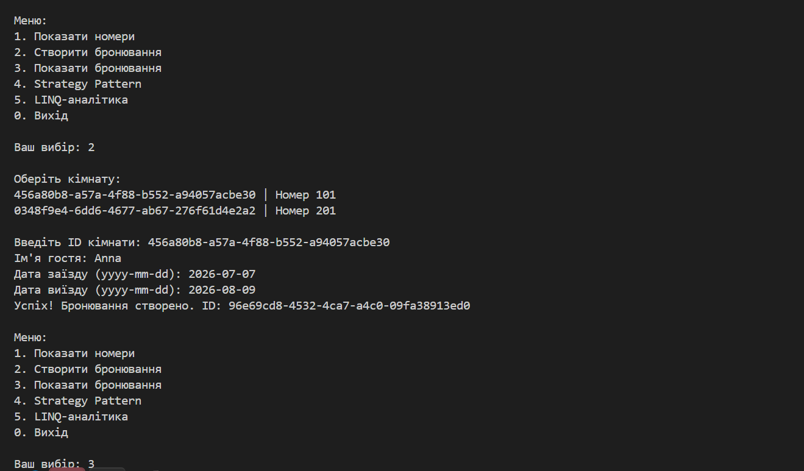
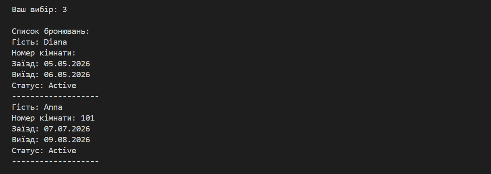

# Final Report

## Опис проєкту

Hotel Booking System — консольна система бронювання готелю.

## Реалізований функціонал

- Перегляд номерів
- Створення бронювання
- Перевірка конфлікту дат
- JSON persistence
- LINQ-аналітика
- Strategy Pattern

## Архітектура

Проєкт реалізований за шаровою архітектурою:
- Domain
- Application
- Infrastructure
- Console UI

## Тестування

Було реалізовано:
- Unit tests
- Integration tests

Усі тести проходять успішно.

## Висновок

Проєкт демонструє використання:
- ООП
- SOLID
- LINQ
- Патернів проєктування
- Тестування
- JSON persistence

# Контрольні питання

## 1. Які рефакторинги були найважливішими саме перед релізом?

Найважливішими були:
- покращення структури Program.cs;
- винесення бізнес-логіки у BookingService;
- усунення дублювання коду;
- покращення error handling через try/catch;
- розділення проєкту на шари Domain, Application та Infrastructure.

## 2. Чим FINAL_REPORT.md відрізняється від README.md?

README.md містить короткий опис проєкту, інструкцію запуску та основні можливості.

FINAL_REPORT.md є підсумковим документом, де описано архітектуру, реалізовані теми курсу, тестування, рефакторинги та висновки по проєкту.

## 3. Які теми курсу ваш проєкт демонструє найкраще, а які довелося добирати окремими розширеннями?

Найкраще проєкт демонструє:
- ООП;
- SOLID;
- LINQ;
- Repository Pattern;
- Strategy Pattern;
- Unit та Integration testing.

## 4. Яке архітектурне рішення ви б змінили, якби починали проєкт заново?

Якби проєкт створювався заново, замість JSON persistence варто було б одразу використовувати базу даних та Entity Framework.
Також можна було б реалізувати Web API або GUI замість консольного інтерфейсу.

## 5. Як ви доводите, що проєкт готовий до захисту, а не просто “ще якось працює”?

Проєкт готовий до захисту, тому що:
- реалізовано всі вимоги лабораторних робіт;
- усі unit та integration тести проходять успішно;
- проєкт має документацію;
- використано архітектурні патерни;
- реалізовано persistence та fault handling;
- структура проєкту відповідає вимогам курсу.

