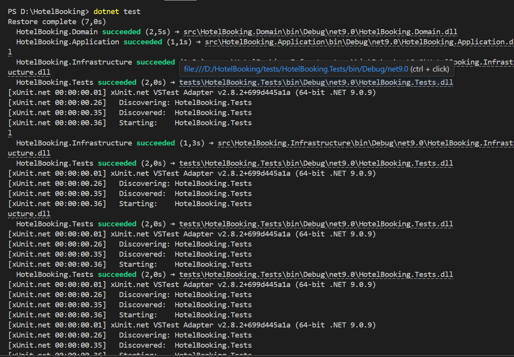
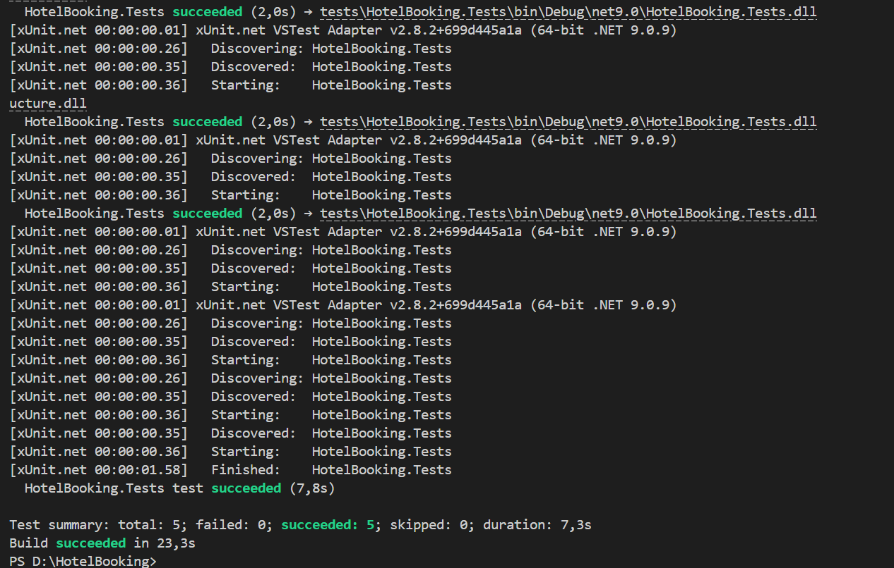

# Hotel Booking System 🏨

Система управління бронюванням номерів у готелі .

## Структура проєкту (Clean Architecture)
- **Domain:** Сутності (Room, Reservation, DateRange) та бізнес-правила.
- **Application:** Бізнес-логіка (BookingService).
- **Infrastructure:** Робота з даними (InMemory репозиторії).
- **Console:** Користувацький інтерфейс.
- **Tests:** Юніт-тести (xUnit).

## Як запустити
1. Відкрити термінал у корені проєкту.
2. Виконати команду: `dotnet run --project src/HotelBooking.Console`
3. Щоб запустити тести: `dotnet test`

