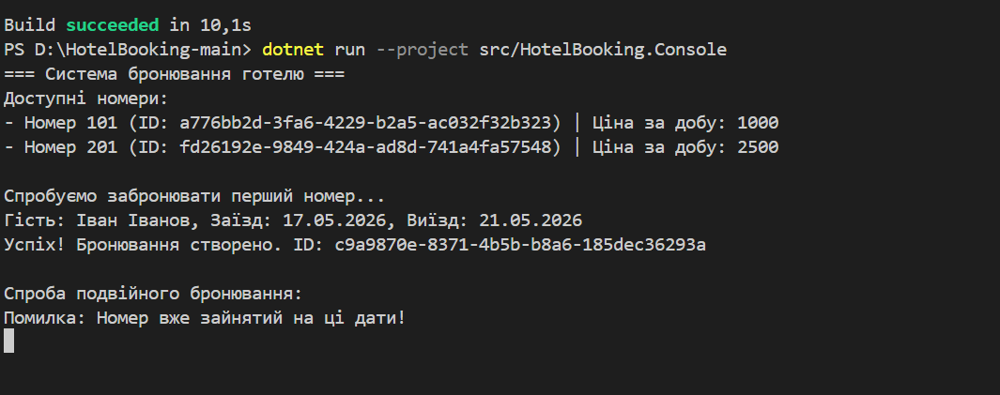

# Звіт за ітерацію №2 (Lab 35)

## 1. Реалізовані сценарії (Use Cases)

### Strategy Pattern для розрахунку вартості
Реалізовано інтерфейс `IPriceStrategy` та окремі стратегії:
- `StandardPriceStrategy`
- `PremiumDiscountStrategy`

Це дозволяє змінювати алгоритм розрахунку вартості без зміни основного коду.

### Робота зі статусами бронювання
Додано enum `ReservationStatus`:
- Active
- Cancelled

Система дозволяє контролювати стан бронювання.

### LINQ-запити
Реалізовано LINQ для:
- отримання списку бронювань
- фільтрації кімнат
- пошуку даних
- роботи з колекціями

## 2. Бізнес-правила (Domain Rules)

- Бронювання має статус (`Active`, `Cancelled`)
- Кімнати зберігаються через репозиторії
- Розрахунок ціни залежить від обраної стратегії
- Premium-знижка застосовується лише при бронюванні від 7 днів

## 3. Патерни проєктування

### Strategy
Використано патерн Strategy через:
- `IPriceStrategy`
- `StandardPriceStrategy`
- `PremiumDiscountStrategy`

Це дозволяє легко додавати нові алгоритми розрахунку ціни без зміни існуючого коду.

## 4. LINQ-запити

У проєкті використано:

- `.FirstOrDefault()` — пошук кімнати за ID
- `.Where()` — фільтрація даних
- `.GetAll()` — отримання колекцій
- LINQ для роботи з бронюваннями та кімнатами

# Контрольні питання (Lab 35)

## 1. Чому persistence-шар залежить від інтерфейсів?

Це дозволяє змінювати спосіб збереження даних без зміни бізнес-логіки програми. Наприклад, можна замінити InMemoryRepository на роботу з базою даних.

## 2. Які правила належать сутностям, а які сервісам?

Сутності відповідають за власний стан і дані.  
Сервіси реалізують бізнес-логіку та взаємодію між сутностями.

## 3. Навіщо LINQ у бізнес-сценаріях?

LINQ спрощує роботу з колекціями:
- пошук
- фільтрацію
- сортування
- отримання даних

Код стає коротшим і читабельнішим.

## 4. Як патерн Strategy допоміг коду?

Strategy дозволив винести алгоритми розрахунку вартості в окремі класи. Завдяки цьому код легко розширювати та підтримувати.

## 5. Що має довести Lab 36?

Lab 36 має показати:
- стабільність системи
- правильну роботу бізнес-логіки
- якісну архітектуру
- тестування та обробку помилок

# Скрін виконаної роботи
