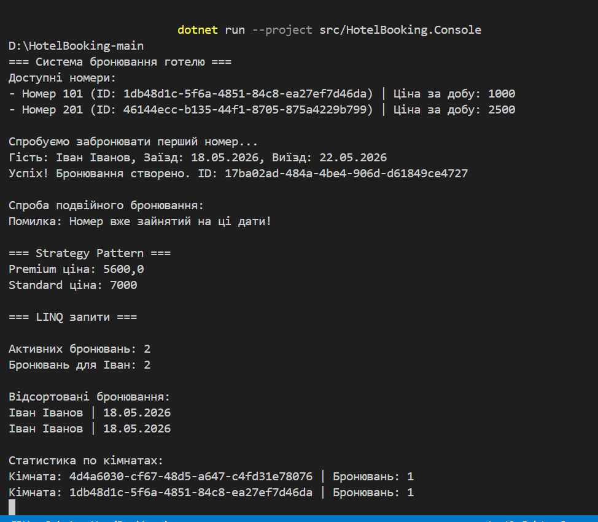

# Звіт за ітерацію №3 (Lab 36)

## 1. Реалізовані сценарії (Use Cases)

### JSON Persistence
Реалізовано збереження бронювань у файл `reservations.json` через `JsonReservationRepository`. Дані автоматично серіалізуються у JSON та відновлюються після запуску програми.

### Fault Handling
У `BookingService` реалізовано обробку помилок через `try/catch`. Система коректно реагує на помилки та конфлікти бронювання.

### Integration Testing
Реалізовано integration tests для перевірки:
- створення бронювання;
- збереження у JSON;
- запобігання подвійного бронювання;
- LINQ-запитів;
- fault handling.

## 2. Бізнес-правила (Domain Rules)

- Ім’я гостя не може бути порожнім.
- Дати бронювання не можуть перетинатися.
- Номер не може бути заброньований двічі на однакові дати.
- Бронювання мають статус (`Active`, `Cancelled`).

## 3. Патерни проєктування

### Strategy
Використано `IPriceStrategy` для реалізації різних алгоритмів розрахунку вартості:
- `StandardPriceStrategy`
- `PremiumDiscountStrategy`

Це дозволяє легко додавати нові стратегії без зміни основної логіки системи.

## 4. LINQ-запити

У програмі використано:

- `.Where()` — фільтрація бронювань;
- `.OrderBy()` — сортування за датою;
- `.GroupBy()` — статистика по кімнатах;
- `.Any()` — перевірка конфлікту бронювань.

# Контрольні питання (Lab 36)

## 1. Де у вашому проєкті достатньо unit tests, а де потрібні integration tests?

Unit tests достатньо для перевірки окремих класів і бізнес-правил:
- DateRange
- Reservation
- Strategy Pattern
- Room

Integration tests потрібні для перевірки взаємодії між шарами:
- BookingService + Repository
- JSON persistence
- LINQ-запити
- повного процесу бронювання.

## 2. Які зміни в архітектурі були зроблені спеціально заради тестованості?

Було використано:
- інтерфейси (`IRoomRepository`, `IReservationRepository`);
- dependency injection через конструктори;
- розділення на шари (Domain, Application, Infrastructure).

Це дозволило легко підміняти repository у тестах та ізолювати бізнес-логіку.

## 3. Які негативні сценарії були найважливішими і чому?

Найважливішими були:
- подвійне бронювання;
- неправильні дати;
- порожнє ім’я гостя;
- помилки під час роботи з persistence.

Вони критичні, тому що можуть пошкодити дані або порушити логіку системи.

## 4. Чому coverage сам по собі не гарантує якість?

Навіть якщо coverage високий, тести можуть перевіряти лише прості сценарії та не знаходити реальні помилки. Важлива не тільки кількість тестів, а й якість перевірок та покриття негативних сценаріїв.

## 5. Які ризики залишаються перед Lab 37, навіть якщо всі тести проходять?

Можуть залишатися:
- помилки продуктивності;
- проблеми при великій кількості даних;
- edge-case сценарії;
- проблеми багатопотоковості;
- помилки інтеграції з іншими системами.

